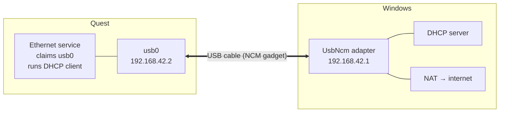

# Wired Steam Link VR

Run Steam Link to your Quest over the USB cable instead of Wi-Fi, using the
headset's built-in USB Ethernet (NCM) gadget. Steam Link reports the connection
as **USB**, because that is genuinely what it becomes.

> **Status:** working, but tested on exactly one headset (Quest 2, Android 14).
> Treat it as beta until more people have run it. Reports welcome — see
> [Testing wanted](#testing-wanted).

## Measured

Quest 2, USB 3 cable, USB 3 port:

| | |
|---|---|
| Round trip to the PC | **0.7 ms** |
| Throughput | **~756 Mbit/s** (94.5 MB/s) |

The throughput figure was disk-bound on the headset, not link-bound, so the
cable has more headroom than that. USB reported 5 Gbps; Windows negotiated the
NCM adapter at 3.8 Gbps.

## Why this exists

The usual "Steam Link over the cable" trick uses [gnirehtet], which relays
every packet through an `adb forward` pipe. That works, but ADB is the
transport, so it is slow.

This project doesn't tunnel anything. It switches the headset's USB port into
NCM mode, so `usb0` appears as a real network interface on both ends. Traffic
never touches ADB — the kernel moves frames over a dedicated USB interface and
Windows binds its inbox `usbncm.sys` driver as an ordinary NIC.

ADB is used for exactly one command at startup, and then sits idle.

[gnirehtet]: https://github.com/Genymobile/gnirehtet

## How it works



The headset is *already* running a DHCP client on `usb0` the moment NCM is
enabled — it broadcasts `DHCPDISCOVER` forever with nobody answering. The whole
trick is supplying a DHCP server on the PC end. On lease, Android brings up a
real `ETHERNET` network and routes over the cable.

The NAT matters more than it looks: Android only prefers the cable over Wi-Fi
once that network **validates**, which requires real internet behind it.
Without NAT the link is up but unused, and you'd have to turn Wi-Fi off.

## Why the obvious approaches don't work

Recording these because all three look right, and the error messages point the
wrong way. Findings from a Quest 2 `hollywood`, Android 14, build
`52202280028100150`, USB gadget HAL `V2_0`.

**1. `svc usb setFunctions ncm,adb` can never work.** `UsbService` runs
`Preconditions.checkArgument(UsbManager.areSettableFunctions(f))`, which
requires *exactly one* function bit. Two throws `IllegalArgumentException`
before the gadget HAL is reached. You don't list `adb` — `UsbDeviceManager`
ORs it in automatically when USB debugging is on. Use plain `ncm`.

**2. RNDIS is not available.** The gadget HAL answers
`setCurrentUsbFunctionsCb failed ... status:4` and the framework falls back to
charging. NCM is the only network gadget this hardware exposes, so the
`rndis,adb` advice found in older guides is a dead end.

**3. This logcat error is a red herring:**

```
Tethering: ERROR could not enable IpServer for function NCM
```

The build ships `tetherableNcmRegexs: []` — empty — so Android's tethering can
never attach an IpServer to the interface. That path is unfixable without root,
and it is *not* the path that works. The Ethernet service is, because its
interface filter is `((eth\d)|(usb\d))` and it claims `usb0` as a **client**.

**4. Any VpnService will swallow the link.** A VPN captures `uid 0-99999`
regardless of routing, so traffic never reaches the cable. gnirehtet-based
setups do exactly this, so the script stops it automatically if it finds it.

## Requirements

- A Quest headset with developer mode enabled — this needs a **verified Meta
  developer account**, which is free but not instant. See below.
- USB 3 cable in a USB 3 port
- Windows 10 or 11, administrator (UAC prompt)
- Android platform-tools — included in the release zip, see
  [Getting adb.exe](#getting-adbexe) if you cloned the repo

## Quick start

**One-time setup**

1. Create a developer organization at
   [developers.meta.com][org], signed in with the same Meta account your
   headset uses. Any name works. Then verify the account — Meta requires
   two-factor authentication **or** a phone number / credit card on file.
   Developer mode does not appear until this is finished, which is where
   almost everyone gets stuck.
2. In the **Meta Horizon** phone app: *Menu → Devices → your headset →
   Headset settings → Developer mode*. Turn it on, then reboot the headset.
3. Plug the headset in, run `adb-scan.bat`, and accept **Allow USB debugging**
   in the headset — tick *Always allow from this computer*. Run it again; the
   headset should be listed with `device` after it.

**Every session**

4. Run `NCM-Run.bat` and approve the UAC prompt.
5. Wait for `Link is up`.
6. Open Steam Link in the headset and connect to your PC. It should show the
   connection as USB.

Leave the window open while playing; press any key in it to restore everything.

### Two working modes

Android only prefers the cable over Wi-Fi once that network passes its internet
check. There are two ways to get there, and the script picks automatically:

| Script says | What happens | Requires |
|---|---|---|
| `NAT is up` | Headset gets internet through the cable and switches to it on its own after ~15 s. Leave Wi-Fi on. | Windows NAT (`MSFT_NetNat`) |
| `Windows NAT is not available` | Script switches the headset's Wi-Fi off, making the cable its only route. Restored on exit. | nothing |

`MSFT_NetNat` ships with Hyper-V, so **Windows Home generally does not have it**
and will use the second mode. Both work — Steam Link doesn't need the headset
to have internet, since the PC is doing the streaming.

The full walkthrough, with troubleshooting, is in **[README.txt](README.txt)**.

[org]: https://developers.meta.com/horizon/manage/organizations/create/

### Options

```
NCM-Run.bat -WifiOff
```

Forces Wi-Fi-off mode instead of trying to share internet. The script already
falls back to this on its own when NAT is unavailable, so you only need the
switch to force it — for example if the NAT clashes with something else on the
PC. `-NoInternet` is accepted as an older name for the same switch.

## What it changes on your PC

It asks for administrator, so here is the full list. Everything is reverted on
exit.

| Change | Reverted by |
|---|---|
| Headset USB switched to NCM | `svc usb setFunctions` (also clears on unplug/reboot) |
| `192.168.42.1/24` on the UsbNcm adapter | address removed, DHCP re-enabled |
| DHCP server on UDP 67 | process stopped |
| NAT for `192.168.42.0/24` | `Remove-NetNat` |
| One inbound firewall rule for that subnet | `Remove-NetFirewallRule` |
| Headset Wi-Fi off — Wi-Fi-off mode only | `svc wifi enable` |

The USB mode change is never persisted — `persist.sys.usb.config` needs root to
modify, so a reboot always returns the headset to normal. If the script is
killed rather than closed properly, the worst case is USB staying in network
mode until you unplug.

## Limitations

- **ADB cannot be eliminated.** `setCurrentFunctions` is `@SystemApi` behind
  `MANAGE_USB` (`signature|privileged`), so no sideloaded app can call it.
  There is no host-side trigger either: the gadget exposes a single USB
  configuration, so `SET_CONFIGURATION` can't select NCM, and AOA accessory
  mode yields a bulk endpoint pair rather than a network interface.
- **Not persistent.** USB mode resets on unplug or reboot, so the script runs
  each session. `svc usb setScreenUnlockedFunctions ncm` may reduce this to
  once per headset — untested.
- **Quest 3 / 3S untested.** Expected to work; unverified.
- Meta's own `EthernetOverUsb` service exists but sits in `DisabledState` even
  with `adc_ethernet_over_usb_enabled=true`, so it appears gated on enterprise
  enrollment. Not usable here.

## Testing wanted

Most useful reports:

- Quest 3 / 3S — does the NCM gadget come up at all?
- Older Quest builds — where does NCM support start?
- Windows Home — confirm the Wi-Fi-off fallback kicks in and Steam Link works
- PCs with existing ICS or Hyper-V setups — does the NAT clash with anything?
- Whether `setScreenUnlockedFunctions ncm` survives a reboot

Please include the output of `adb shell svc usb getFunctions` and, if it fails,
`adb logcat -d | findstr /i "UsbDeviceManager DhcpClient Tethering"`.

## Getting adb.exe

**Downloading the release zip?** ADB is already in it — skip this section.

**Cloning the repo?** ADB is deliberately not committed, both to keep a 6.3 MB
binary out of git history and because the Android SDK license restricts
redistributing platform-tools. Download [platform-tools][pt] and drop these
three files next to `NCM-Run.bat`:

```
adb.exe    AdbWinApi.dll    AdbWinUsbApi.dll
```

Nothing gets installed and nothing goes on your PATH. The script looks for ADB
in this order:

1. next to the script
2. `platform-tools\` beside the script
3. `Android\platform-tools\` beside the script
4. system `PATH`

[pt]: https://developer.android.com/tools/releases/platform-tools

## Credits

- [gnirehtet] by Genymobile — the tunnelling approach this replaces
- Built and maintained by UbootVRC

## License

[MIT](LICENSE) — use it, change it, ship it, just keep the copyright notice.

`adb.exe` and its DLLs, where bundled in a release, are Google's Android
platform-tools and are covered by the Android Software Development Kit License
Agreement, not by the MIT license above.
